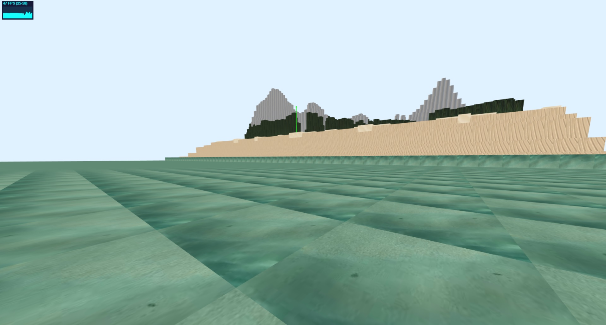
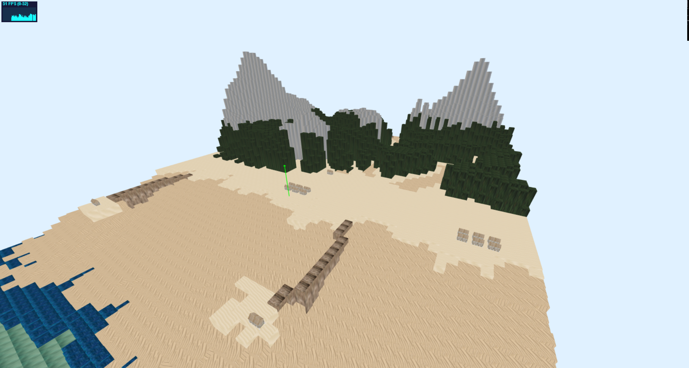
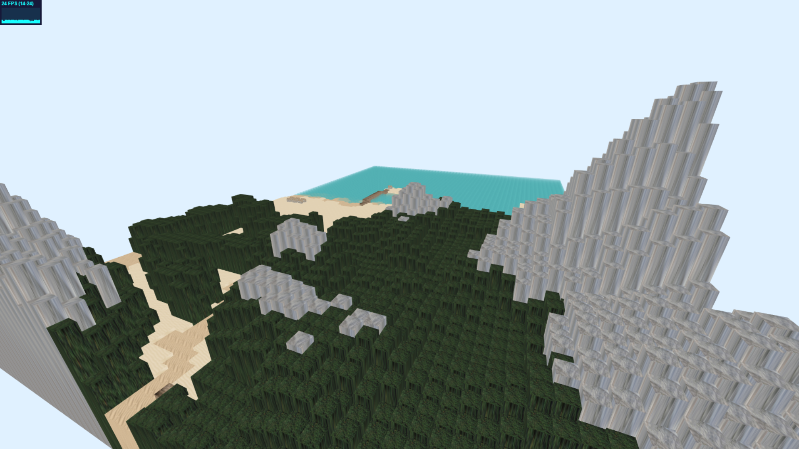
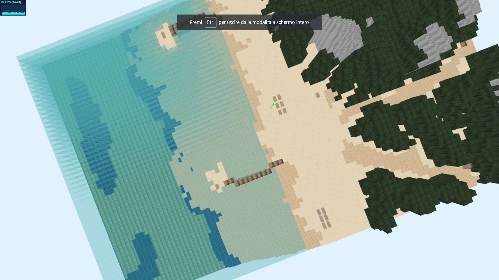
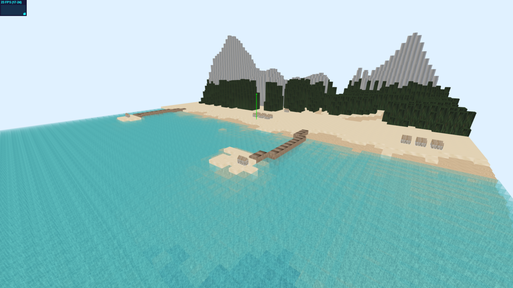
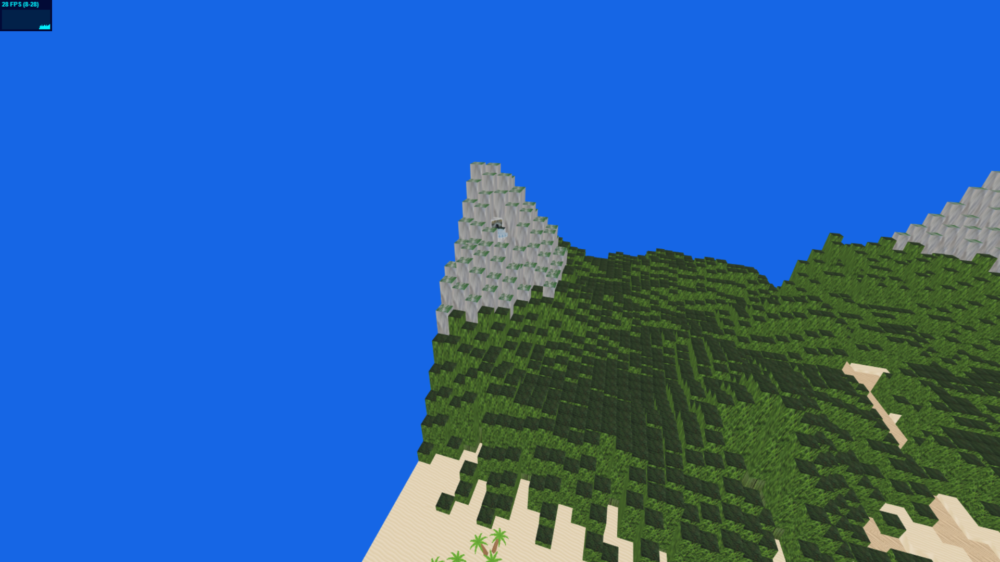
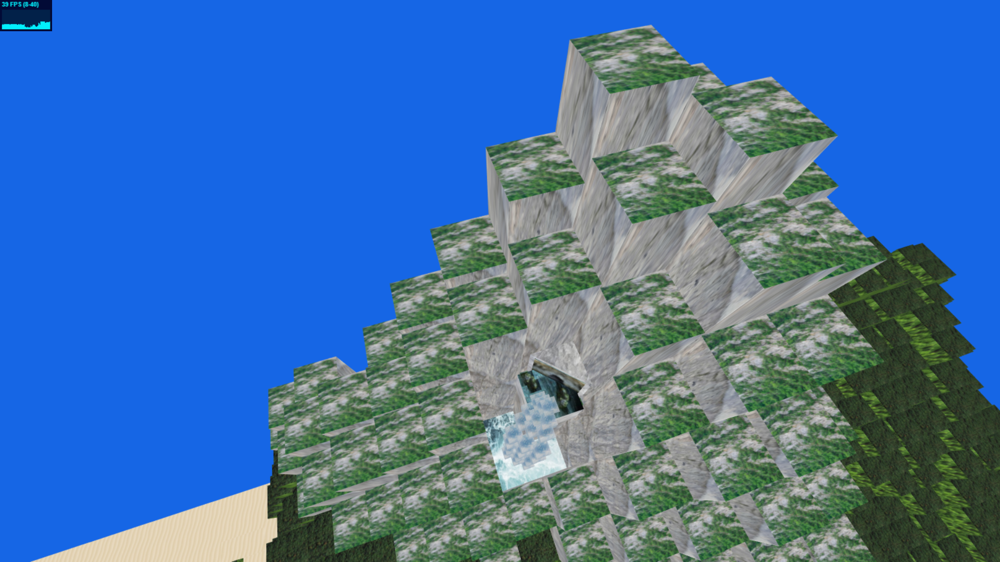
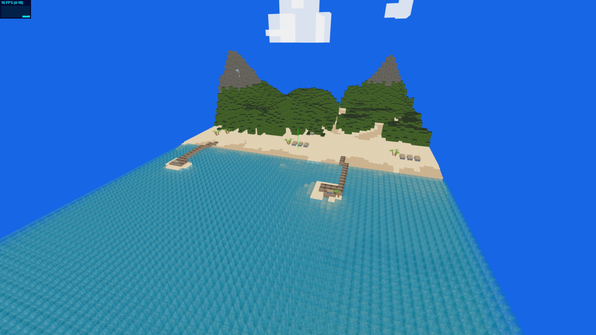

# Modeling and rendering with boxes - Gomirato, Tomat

## Note

E' stato riscontrato che, nei calcolatori dotati di schede video non sufficientemente potenti, le animazioni, in particolare il flusso d'acqua della cascata e le onde del mare, non risultano fluide.

Per poter riprodurre correttamente il progetto è necessario eseguirlo in locale. Per farlo ho usato XAMPP. Vedere documentazione THREE.js per ulteriori chiarimenti.

E' presente un artefatto sotto il terreno, un cubo che compone il mare, causato dalla sua animazione. Il motivo non è ancora noto. Toglieno l'animazione per le onde, l'artefatto sparisce.

## Descrizione progetto

In questo progetto è stata ricreata una spiaggia utilizzando come geometria solamente BoxGeometry. Per la creazione del terreno e del mare sono state sfruttate due diverse Height Map. Quella riguardante il terreno è stata creata cercando nel web una già pronta che raffigurasse una montagna; da quella, una volta decise le dimensioni che la spiaggia avrebbe dovuto avere, è stata creata la height map definitiva. Attraverso quest' ultima è stato definito il graduale passaggio dal fondale marino alla riva, ai pontili, alla foresta e alla montagna. Per ogni pixel della mappa, è stato fatto corrispondere un cubo, che viene scalato e traslato in base alla gradazione di nero del pixel della height map in considerazione. Sempre in base a questo valore, un algoritmo decide quale materiale usare, e quindi, quale texture applicare al cubo appena creato.

## Gli assets

Gli elementi della spiaggia che non sono generati dalle height map sono stati definiti in file .js esterni. Nel file principale .html viene richiamata una classe( file .js) per ogni elemento da aggiungere alla scena. Gli assets vengono poi aggiunti e posizionati staticamente.
Il mare è composto da una matrice di cubi, generati da una height map apposita.
Per le montagne, la foresta e alcune parti della cascata è stato usato un materiale di tipo  MultiMaterial.

## Le animazioni

Le animazioni, come gli assets, vengono gestite da file esterni. In particolare, per l'animazione della cascata, è stata sfruttata una spline per definire la traiettoria che il flusso d'acqua avrebbe dovuto avere. Vengono usati tre distinti flussi e ognuno è composto da una serie di cubi, temporizzati e sincronizzati in modo da dare l'illusione della fluidità.

Il mare viene animato traslando verso +Y due file adiacenti con due valori diversi; questo processo viene iterato frame per frame, e crea l'illusione che l'onda stia avanzando verso la riva.

Per ciò che riguarda l'animazione dei pesci:
- Lo squalo si muove grazie ad un pivot. Infatti ciò che si muove realmente è quest'ultimo; lo squalo si muove di conseguenza dato che suo "figlio" nella gerarchia. Quando il pivot raggiunge un punto limite all'interno della scena, non fa altro che ruotare su se stesso di 180° e tornare indietro. Il processo si ripete quando raggiunge il punto limite opposto.
- Per i pesci è stata sfruttata anche qui una spline. I punti però invece che essere statici, vengono calcolati in maniera casuale. Una volta che la spline ha interpolato tutti i punti, ne vengono calcolati di nuovi, sempre in maniera random.

## Alcuni screenshot delle fasi del progetto

### primi prototipi

### aggiunta del mare

### miglioramento texture e aggiunta cascata più nuvole

### miglioramento texture con implementazione wrapping

