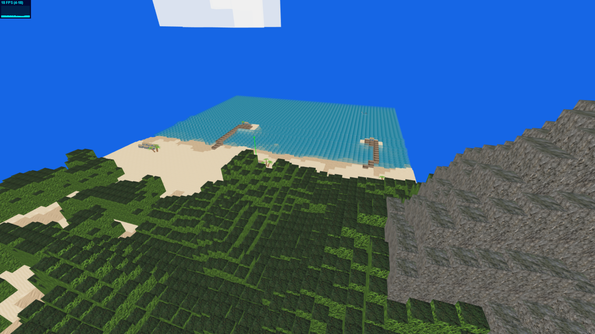

# Modeling and rendering with boxes - Gomirato, Tomat

## Descrizione progetto

In questo progetto è stata ricreata una spiaggia utilizzando come geometria solamente BoxGeometry. Per la creazione del terreno e del mare sono state sfruttate due diverse Height Map. Quella riguardante il terreno è stata creata cercando nel web una già pronta che raffigurasse una montagna; da quella, una volta decise le dimensioni che la spiaggia avrebbe dovuto avere, è stata creata la height map definitiva. Attraverso questa è stato definito sia il graduale passaggio dal fondale marino alla riva, ai pontili, alla foresta e alla montagna. Per ogni pixel della mappa, è stato fatto corrispondere un cubo, che viene scalato e traslato in base alla gradazione di nero del pixel in considerazione. Sempre in base a questo valore, un algoritmo decide quale materiale usare, e quindi, quale texture applicare al cubo appena creato.
